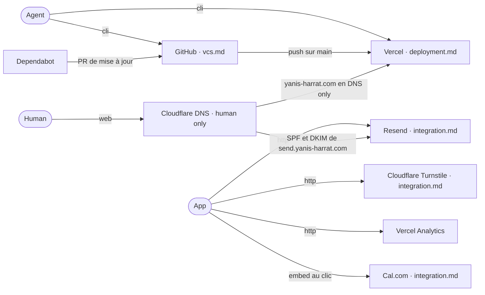

# Ecosystem

```mermaid
flowchart LR
  Human([Human])
  Agent([Agent])
  App([App])
  GitHub["GitHub · vcs.md"]
  Dependabot["Dependabot"]
  Vercel["Vercel · deployment.md"]
  Analytics["Vercel Analytics"]
  DNS["Cloudflare DNS · human only"]
  Turnstile["Cloudflare Turnstile · integration.md"]
  Resend["Resend · integration.md"]
  Cal["Cal.com · integration.md"]

  Agent -- cli --> GitHub
  Agent -- cli --> Vercel
  Human -- web --> DNS
  App -- http --> Turnstile
  App -- http --> Resend
  App -- http --> Analytics
  App -- "embed au clic" --> Cal

  Dependabot -- "PR de mise à jour" --> GitHub
  GitHub -- "push sur main" --> Vercel
  DNS -- "yanis-harrat.com en DNS only" --> Vercel
  DNS -- "SPF et DKIM de send.yanis-harrat.com" --> Resend
```
